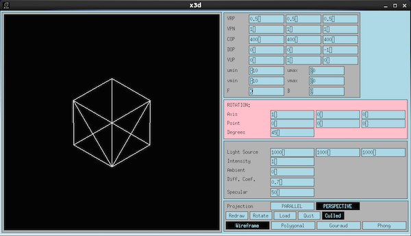
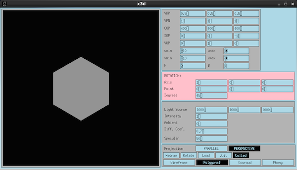
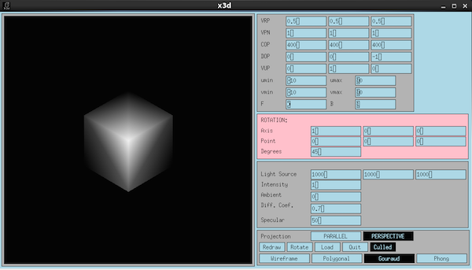
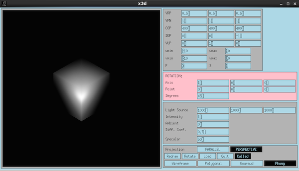

# X3D - A simplistic 3D rendering program in C

[img/wireframe.png "wireframe"]

This is a simple renderer which uses Athena Widgets for the GUI. It is possible to compile but the interface is not so great compared to more recent GUI frameworks.

You can render in wireframe:



Polygonal shading:



Gouraud shading:



Phong shading:




The file format is as follows, where N is the number of vertices in the object and M is the number of polygons. Polygons will be broken into triangles if not triangles already:

```
<N>
<vertex 0: x y z> # x, y, and z are floats
...
<vertex N-1: x y z> 
<M>
<polygon 0: P color#> # color is a number from 0-255. 1 is a good value.
...
<polygon M-1: 0->N-1> # The number is a reference to one of the vertices defined in the first part of the file
```

The order of the vertices in the polygons must be counterclockwise for the shading to work properly.

For example, a simple cube could be represented as follows.

cube.x3d
```
8
0 0 0
0 0 5
0 5 0
0 5 5
5 0 0
5 0 5
5 5 0
5 5 5
6
4 1
0
1
3
2
4 1
0
4
5
1
4 1
2
3
7
6
4 1
6
7
5
4
4 1
6
4
0
2
4 1
5
7
3
1
```


